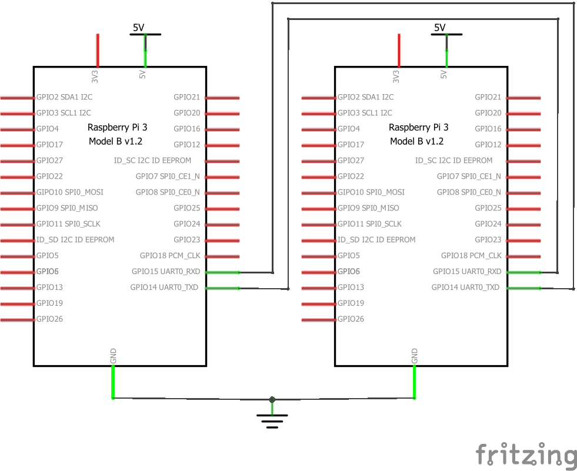

# Setup energy measurement

To use the energy measurement service, the two device have to send messages via UART communication. If the measured device is a Raspberry Pi 3, the following figure shows the proper wiring.



## General information

The measurement service listens to its serial port and respond to the given commands. It recognizes two types of commands: START and STOP.

```python
    class Command(Enum):
      START = 1
      STOP  = 2
```

The messages have to be sent as serialized JSON objects.

```json
    { "command" : 1, "msg": "measurement_name" }
    { "command" : 2, "msg": "measurement_name" }
```

The integer value represents the command value. The "msg" part is the measurement ID. When a measurement has started with ID "abc_1", then it has to be stopped with the same ID. If this requirement is violated, the measurement is dropped without any saving.

Only one running measurement is allowed, the second request is dropped and the requester gets an error message.

Existing implementations can be used to make measurements:

* Python: [communication_helper.py](../scripts/communication_helper.py)

* C++:

* JavaScript
